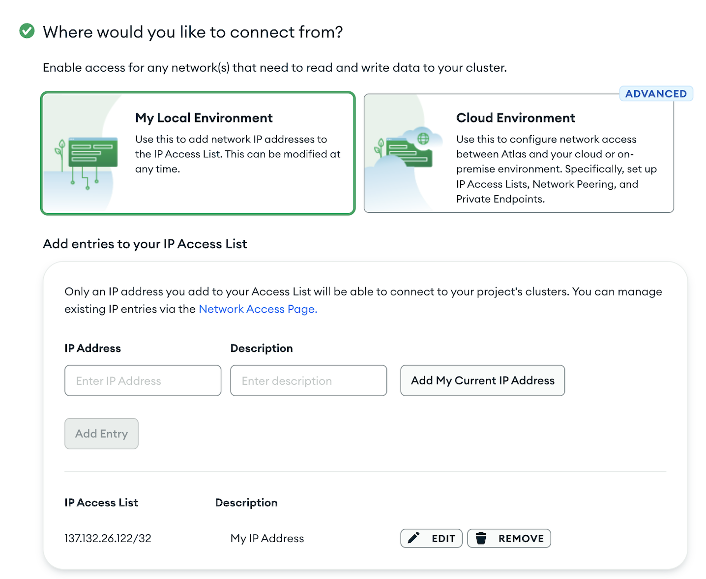
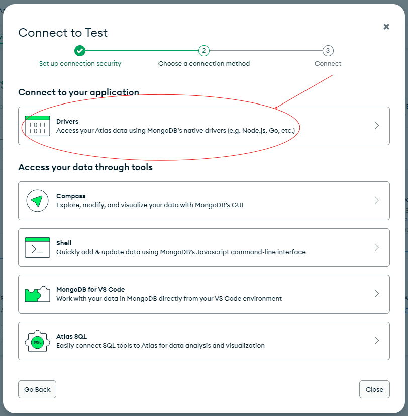
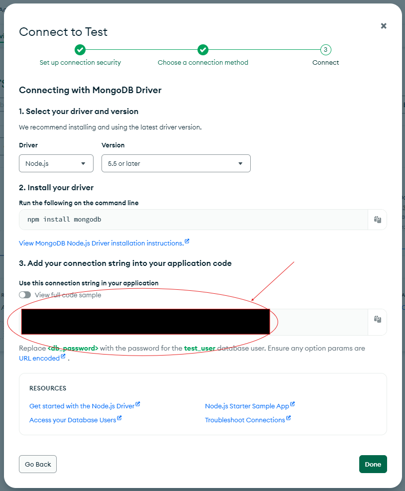

# CS3219 Project (PeerPrep) - AY2425S1
## Group: G38

### Team Members:
- [Daniel](https://github.com/dloh2236)
- [James](https://github.com/jayllo-c)
- [Johan](https://github.com/delishad21)
- [Joshua](https://github.com/dloh2236)

# Milestone 4 Submission - Matching Service

## Prerequisites

1. Clone this repository to your local machine.
2. Ensure you have Docker installed.
3. (Optional) Sign up for a MongoDB Atlas account
   - The docker compose file is configured to use a local MongoDB instance by default. If you would like to use a remote MongoDB instance, you can follow the instructions in the ["Remote DB Setup"](#remote-db-setup-mongodb-atlas-optional) section below.

## Docker Compose for all services (including frontend)

1. Open a terminal and navigate to the root directory of the project.
2. Duplicate the .env.sample file and rename it to .env
   - If you wish to, you can modify the values in the .env file
      | **Variable** | **Description** | **Default Value** |
      |--------------|-----------------|-------------------|
      | NEXT_PUBLIC_USER_SERVICE_URL | URL of the user service | http://localhost:8004 |
      | NEXT_PUBLIC_QUESTION_SERVICE_URL | URL of the question service | http://localhost:8003 |
      | NEXT_PUBLIC_QUESTION_SERVICE_URL | URL of the question service | http://localhost:8003 |
      | NEXT_PUBLIC_IMAGE_UPLOAD_KEY | AuthToken for image upload | None, you can get this from https://www.portive.com |
      | FRONTEND_PORT | Port to run the frontend service | 3000 |
      | USER_MONGODB_URI | MongoDB URI for the user service | None, commented out. If you are using a remote MongoDB instance, you can key in your connection string here |
      | USER_MONGO_INITDB_ROOT_USERNAME | MongoDB root username for the user service | userroot |
      | USER_MONGO_INITDB_ROOT_PASSWORD | MongoDB root password for the user service | userpassword |
      | USER_PORT | Port to run the user service | 8004 |
      | JWT_SECRET | Secret for creating JWT signature | you-can-replace-this-with-your-own-secret |
      | QUESTION_MONGODB_URI | MongoDB URI for the question service | None, commented out. If you are using a remote MongoDB instance, you can key in your connection string here |
      | QUESTION_MONGO_INITDB_ROOT_USERNAME | MongoDB root username for the question service | questionroot |
      | QUESTION_MONGO_INITDB_ROOT_PASSWORD | MongoDB root password for the question service | questionpassword |
      | QUESTION_PORT | Port to run the question service | 8003 |
      | MATCHING_PORT | Port to run the matching service | 8002 |
      | USER_SERVICE_URL | URL of the user service (for matching) | http://g38-user-service:8004 |
      | REDIS_URL | URL of the Redis instance | redis://redis:6379 |
      | MATCHING_SERVICE_LOGS_DIR | Directory to store logs for the matching service | ./logs |
      | MATCHING_TIMEOUT | Timeout for matching in milliseconds | 10000 |

3. Run `docker-compose up` to start the services.
   - If you keyed in remote MongoDB URIs in the .env file, the MongoDB containers will not be started. The services will connect to the remote MongoDB instances instead.
4. Once the services are up and running, you can access the frontend at `http://localhost:<FRONTEND_PORT>` (default: <http://localhost:3000>)

## Docker Compose for individual services

If the services are to be run individually (e.g. for deployment on different platforms), you can follow the instructions below.

### Matching Service

1. cd into the matching-service directory
2. Duplicate the .env.sample file and rename it to .env
   - If you wish to, you can modify the values in the .env file

      | **Variable** | **Description** | **Default Value** |
      |--------------|-----------------|-------------------|
      | MATCHING_PORT | Port to run the service | 8002 |
      | USER_SERVICE_URL | URL of the user service | http://localhost:8004 |
      | REDIS_URL | URL of the Redis instance | redis://redis:6379 |
      | MATCHING_SERVICE_LOGS_DIR | Directory to store logs for the matching service | ./logs |
      | MATCHING_TIMEOUT | Timeout for matching in milliseconds | 10000 |

3. Run `docker-compose up` to start the matching service.

### Question Service

1. cd into the question-service directory
2. Duplicate the .env.sample file and rename it to .env
   - If you wish to, you can modify the values in the .env file

      | **Variable** | **Description** | **Default Value** |
      |--------------|-----------------|-------------------|
      |QUESTION_MONGODB_URI  | MongoDB URI     | None, commented out. If you are using a remote MongoDB instance, you can key in your connection string here |
      | QUESTION_PORT         | Port to run the service | 8003 |
      | MONGO_INITDB_ROOT_USERNAME | MongoDB root username | root |
      | MONGO_INITDB_ROOT_PASSWORD | MongoDB root password | password |

3. Run `docker-compose up` to start the question service.
   - If you keyed in a remote MongoDB URI in the .env file, the MongoDB container will not be started. The question service will connect to the remote MongoDB instance instead.

**Common Issue and Troubleshooting**

Issue: MongoParseError: URI malformed
- Solution: Ensure that the MONGODB_URI in your .env file is correctly formatted with the right username, password, and database name.

### User Service

1. cd into the user-service directory
2. Duplicate the .env.sample file and rename it to .env
   - If you wish to, modify the values in the .env file to change the port that the service is hosted on.

      | **Variable** | **Description** | **Default Value** |
      |--------------|-----------------|-------------------|
      | USER_MONGODB_URI  | MongoDB URI     | None, commented out. If you are using a remote MongoDB instance, you can key in your connection string here|
      | MONGO_INITDB_ROOT_USERNAME | MongoDB root username | root |
      | MONGO_INITDB_ROOT_PASSWORD | MongoDB root password | password |
      | USER_PORT         | Port to run the service | 8004 |
      | JWT_SECRET | Secret for creating JWT signature | you-can-replace-this-with-your-own-secret |
3. Run `docker-compose up` to start the user service.
   - If you keyed in a remote MongoDB URI in the .env file, the MongoDB container will not be started. The user service will connect to the remote MongoDB instance instead.

### Frontend

1. Navigate to the frontend directory: cd frontend/peerprep
2. Duplicate the .env.sample file and rename it to .env
   - If you wish to, you can modify the values in the .env file

      | **Variable** | **Description** | **Default Value** |
      |--------------|-----------------|-------------------|
      | NEXT_PUBLIC_QUESTION_SERVICE_URL | URL of the question service | http://localhost:8003 |
      | NEXT_PUBLIC_IMAGE_UPLOAD_KEY | AuthToken for image upload | None, you can get this from https://www.portive.com |
      | FRONTEND_PORT | Port to run the frontend service | 3000 |
3. Run `docker-compose up` to start the frontend service.

## Building your own Docker iamges

1. cd into the any of the service directories (question-service, user-service, frontend/peerprep)
2. Run `docker build -t "<image-name>" .` to build the Docker image.

## Matching Service API

The matching service API can be found here: [Matching Service API](./matching-service/README.md)

## API Endpoints for User and Question Service

**User Service API Endpoints**

The user service API can be found here: [User Service API](./user-service/README.md)

**Question Service API Endpoints**

The question service API can be found here: [Question Service API](./question-service/README.md)

## Remote DB Setup (MongoDB Atlas) (Optional)

1. Visit the MongoDB Atlas Site [https://www.mongodb.com/atlas](https://www.mongodb.com/atlas) and click on "Try Free"

2. Sign Up/Sign In with your preferred method.

3. You will be greeted with welcome screens. Feel free to skip them till you reach the Dashboard page.

4. Create a Database Deployment by clicking on the green `+ Create` Button:

5. Make selections as followings:

- Select Shared Cluster
- Select `aws` as Provider

- Select `Singapore` for Region

- Select `M0 Sandbox` Cluster (Free Forever - No Card Required)

> Ensure to select M0 Sandbox, else you may be prompted to enter card details and may be charged!

- Leave `Additional Settings` as it is

- Provide a suitable name to the Cluster

6. You will be prompted to set up Security for the database by providing `Username and Password`. Select that option and enter `Username` and `Password`. Please keep this safe as it will be used in User Service later on.

7. Next, click on `Add my Current IP Address`. This will whiteliste your IP address and allow you to connect to the MongoDB Database.

8. Click `Finish and Close` and the MongoDB Instance should be up and running.

9. The connection string can be found by clicking on the `Connect` button on the Cluster Overview Page. followed by `Drivers`.

## Whitelisting All IP's

1. Select `Network Access` from the left side pane on Dashboard.

2. Click on the `Add IP Address` Button

3. Select the `ALLOW ACCESS FROM ANYWHERE` Button and Click `Confirm`

Now, any IP Address can access this Database.

